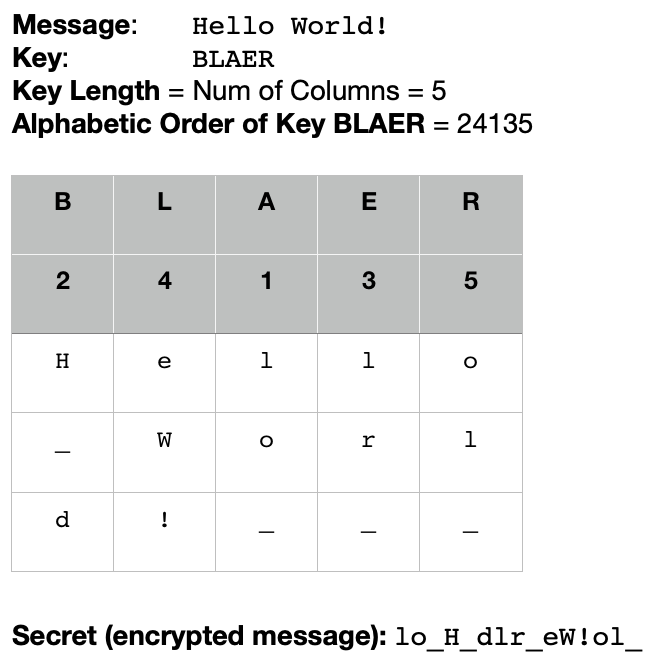

# Secret Messages

Cryptography is the practice and study of securely sending and receiving private messages without an unintended third party being able to read them. In its most basic form, a message is _encrypted_ (i.e. the message is transformed so that it is not immediately comprehensible) via some encryption technique. The encrypted message is then sent to its intended party, safely knowing that, if the message is intercepted by an "enemy", the contents of the message will not be immediately decipherable. The intended recipient, knowing the encryption technique, uses it to _decrypt_ the message back into normal human language. Often, the encryption technique (more specifically, an algorithm called a _cipher_) requires a _key_, so the recipient needs to know both the encryption technique **and** the _key_. Read more about cryptography here https://en.wikipedia.org/wiki/Cryptography.

In this assignment, you will be creating both an encryptor (`Encryptor.java`) to encrypt messages and a decryptor (`Decryptor.java`) to decrypt them. You should be able to instantiate on object of type `Encryptor` that will use _any single one_ of the encryption techniques below to encrypt messages using the method `encrypt()`. That is, a single object of type `Encryptor` does not need to be able to encrypt using all three of the encryption techniques at once; only one encryption type per instantiation (see `CryptoTester.java` for more clarity). The same goes for objects of type `Decryptor`. Each `Encryptor` and `Decryptor` object is tied to a single _key_. If you would like to add functionality to be able to change the _key_, you can add a simple mutator method.

You need to code the classes `Encryptor.java` and `Decryptor.java` using the provided skeleton code. Unless specified in the skeleton code, do not change the skeleton code. In each file `Encryptor.java` and `Decryptor.java`, you need to code the method corresponding to each encryption technique below. 

## Part 1: Substitution (Caesar Cipher) - 25 points
The Caesar Cipher is one of many substitution techniques, and one of the earliest recorded. The idea is simple: the key is a positive integer _n_ you choose between 0-25. For each letter in the message, you replace that letter with a letter in the alphabet that is _n_ spaces to the right from it. For example, if _n_=3, and the message is just a single 'A', then the encrypted message is 'D'. Here's a longer example on the same _n_.

"Hello World" --> "Khoor Zruog"

To decrypt, you simply move _n_ spaces to the left. 

### Hints
* Any ASCII character value between 32 and 126 (inclusive) is fair game for both the message and the secret
* Remember that the primitive `char` actually has an associated integer value according to the ASCII table

## Part 2: Additive (XOR Cipher) - 15 points
For this encryption technique, we exploit the fact that every `char` has an numerical ASCII value which, for the machine, is in binary. To encrypt a _message_, we choose an arbitrary character  as the _key_ and, using the bitwise operator XOR (exclusive OR), we repeatedly XOR the numerical value of that _key_ character with each character in the _message_ string. The result of XOR'ing all the characters in the _message_ with the single `char` _key_ is the _secret_ `String`. E.g.  

    Message: "Hi" --> 72 73 --> 01001000 01001001 
    Key: 'A'--> 65 --> 01000001

             H: 01001000    I: 01001001
         xor A: 01000001    A: 01000001
             ------------   ------------
    secret:     00001001       00001000

To decrypt the _secret_ back to the _message_, you take the _secret_ (here the ASCII values 00001001 and 00001000) and then XOR each character with the _key_. 

### Hints
* The XOR operator in JAVA is  `^` (located above the number 6 on most keyboards)
* Don't overthink it; the XOR operator works just like any other binary operator (e.g. `+`, `-`, etc.)
* Unlike with the other techniques, you'll likely not be able to print out the secret for this one. The reason is that the XOR operation might render a numerical value that is either not on the ASCII table or that means something that can't be printed (e.g. values 0-31 on the ASCII table).

## Part 3: Transposition (Columnar) - 10 points
Unlike the above two encryption techniques, this cipher is a little more difficult to crack for a novice code breaker. Since this technique is slightly more complex, it's better to describe it in steps. The encryption and decryption descriptions below are meant for you to draw out on paper. The drawing and instructions should help inspire your algorithm for this cipher.
### Encryption
1. Create a table where each letter of the **key** is its own column. This is your table header.
2. For each letter in your **message**, place a letter from left to right under each column, creating a new row when you reach the end of the table.
3. Once your entire message is in the table, number each column according to alphabetical order **of the letters in the header (alphabetical order of each letter in the key)**
4. Now write down each letter of the message from top to bottom in the alphabetical order of the column headers.

Here's an example of how that looks:

### Decryption
1. You will need to create a table. To figure out the number of rows your table will need you will need to divide your message length by the key length (rounding up since there's no such thing as partial rows in a table).
2. Make sure each letter in your key is its own column header
3. Write out the message in each column from top to bottom, going column by column according to the column header's alphabetical ordering
4. Once the table is filled out, your message should be easily decipherable from left to right.
### Hints
* Do this problem last!
* Try your best but it's ok if you need to skip this one...it's only 10 points.
* In the image above the `_` is just to make explicit that it's a space; you don't have to do anything special with spaces since they're just normal ASCII characters.
* You already read about how to do tables in the Big Java book: it's just a two-dimensional array (see chapter 7.6)
* Don't neglect to look over the `String` class and `Arrays` class in the Java API for any helpful methods! (e.g. if you need to sort or convert a string to an array of `char`)
* Don't overthink it; this doesn't require anything other than some `for` loops, arrays, maybe one or two Java API tools, and logical thinking

## Tester - 0 points
Look at the example for testing the Substitution cipher in the skeleton code of `CryptoTester.java`. Follow this example and create objects of type `Encryptor` and `Decryptor` for _each_ of the remaining two ciphers: Additive and Transposition. Use the existing variable (called `message`) in all of the tests so that you're already encrypting and decrypting the string "Hello World". 
* For Additive use the character `p` as the key.
* For Transposition use the word `APPLE` as the key.

Make sure to print out the exact same format as the example that's provided. You are welcome to test other keys and messages; we certainly will when grading!

## General Hints
* Start by looking at `CryptoTester.java` and understanding what it looks like to actually use these classes. Then work on `Encryptor.java`. `Decryptor.java` will basically just be the reverse of whatever you did in `Encryptor.java`.
* Using the `String` class' `toLowerCase()` method might prove useful to ensure standardization of argument input if and when doing `String` comparisons.
* Remember that `Object` is the parent class of all Java clasees. That is, you can safely cast from any variable of type `Object` to any other object variable (e.g. `String`). Since primitive data types are not object data types, this does not apply to them.
* Take note of the fact that only `encrypt()` is public. All other methods are private so they cannot be invoked from outside the class file in which they are defined.
